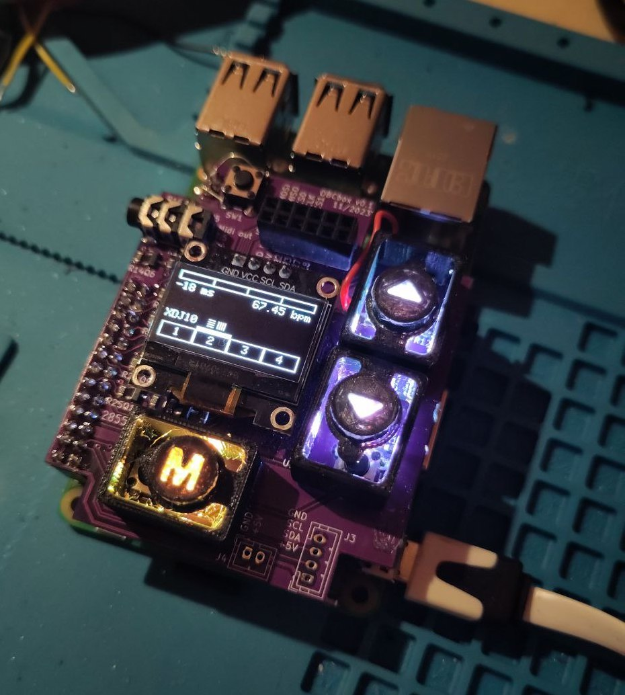

# OBCGUI
Java-project that implements the GUI of the [obcbox-project](https://github.com/kokospalme/java-BC).
* Software: [main-project(obcbox)](https://github.com/kokospalme/java-BC)
* Software: [obcgui](https://github.com/kokospalme/obcgui/)
* Hardware: [grabcad](https://grabcad.com/library/obcbox-enclosure-v1-0-1)

# status quo
<a href=""></a>
- leds are implemented
- display and leds are working in direct ```obcgui.jar``` application
## known bug
```OBCgui.init()```throws exception when obcgui is packed with maven and then added to java-BC project. log:
```
pi@obcbox:~ $ sudo java -jar /home/pi/java-BC.jar -r -B -l=-17
init gui
Feb 12, 2024 5:54:59 PM com.pi4j.Pi4J newContextBuilder
INFO: New context builder
display initialized.
init leds.
Exception in thread "main" 0
java.lang.NoClassDefFoundError: com/diozero/ws281xj/LedDriverInterface
	at com.obcgui.OBCgui.init(OBCgui.java:170)
	at org.deepsymmetry.jbce.Main.main(Main.java:369)
Caused by: java.lang.ClassNotFoundException: com.diozero.ws281xj.LedDriverInterface
	at java.base/jdk.internal.loader.BuiltinClassLoader.loadClass(BuiltinClassLoader.java:581)
	at java.base/jdk.internal.loader.ClassLoaders$AppClassLoader.loadClass(ClassLoaders.java:178)
	at java.base/java.lang.ClassLoader.loadClass(ClassLoader.java:527)
	... 2 more
```
I anyone has an idea why this happens, please let me know on [Zullip](https://deep-symmetry.zulipchat.com/#narrow/stream/275322-beat-link-trigger/topic/Orange.20pi.20zero.202.20.2B.20UI.3F)

# integration in OBCgui
* compile via maven as .jar-file
* use obcgui in [obcbox-project](https://github.com/kokospalme/java-BC) project
